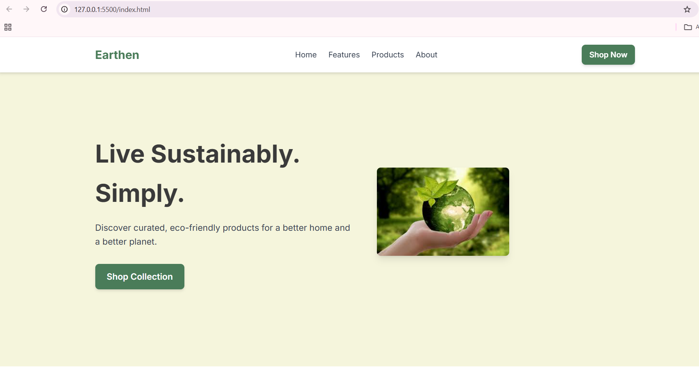
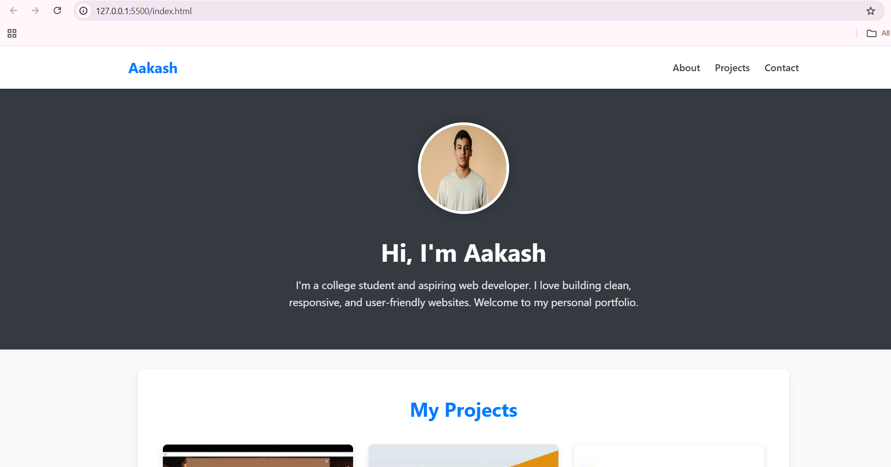

# Oasis Infobyte Internship- Task Completion

#  Task 1:Earthen - Responsive Landing Page
This project is a clean, modern, and fully responsive landing page for "Earthen," a fictional sustainable goods brand.
This project was built as a submission for **Task 1 (Landing Page)** of the **Oasis Infobyte Web Development and Designing Internship (Level 1)**.

##  Screenshot

---

##  Features

* **Semantic HTML5:** Structured with semantic tags like `<header>`, `<main>`, `<section>`, and `<footer>` for better accessibility and SEO.
* **Sticky Navigation:** A navigation bar that sticks to the top of the page for easy access.
* **Modern CSS Layouts:** Uses **CSS Grid** and **Flexbox** to create responsive, complex layouts for the hero, features, products, and footer sections.
* **Mobile-First & Responsive:** The design is fully responsive and adapts seamlessly from mobile phones to tablets and desktops.
* **CSS Custom Properties:** Uses CSS variables (`:root`) for a clean, maintainable color palette and easy theme management.
* **Single-Page Design:** A smooth-scrolling single-page experience using anchor links.

---

##  Technologies Used

* **HTML5**
* **CSS3**
    * CSS Grid
    * Flexbox
    * Media Queries
    * CSS Custom Properties (Variables)
* **Google Fonts** (Inter)

# Task2: Personal Portfolio Website
This is a clean, modern, and responsive personal portfolio website. It's designed to introduce "Aakash" as an aspiring web developer and showcase his projects.
This project was built as a submission for a **Task 2 - Personal Portfolio** of the **Oasis Infobyte Web Development and Designing Internship (Level 1)**.

##  Screenshot

---

##  Features

* **Semantic HTML5:** Well-structured markup using `<nav>`, `<header>`, `<main>`, `<section>`, and `<footer>` for accessibility and SEO.
* **Responsive Design:** Fully responsive layout that adapts from mobile to desktop screens using **CSS Grid** (`auto-fit`, `minmax`) and a flexible navigation menu.
* **Sticky Navigation:** The navigation bar remains "stuck" to the top of the viewport for easy navigation.
* **Modern CSS:**
    * **CSS Custom Properties (`:root`)** are used for an easy-to-manage and consistent color scheme.
    * **Flexbox** is used for aligning navigation items.
    * **CSS Grid** is used for the responsive project gallery.
* **Interactive UI:** Smooth hover effects on project cards and buttons to provide visual feedback to the user.
* **Project Showcase:** A clean card-based layout to display projects, including the "Cafe Management System" built with Python.

---

##  Technologies Used

* **HTML5**
* **CSS3**
    * CSS Grid
    * Flexbox
    * Media Queries
    * CSS Custom Properties (Variables)
